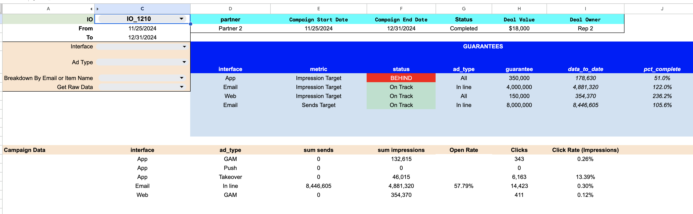
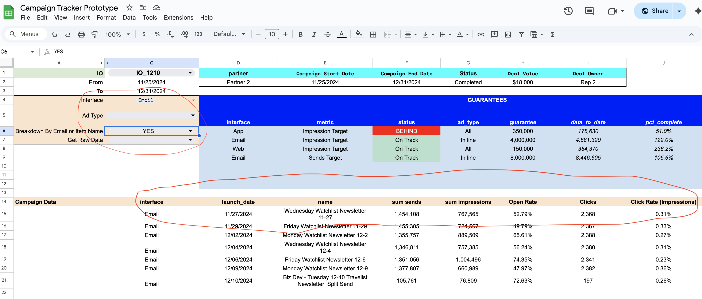
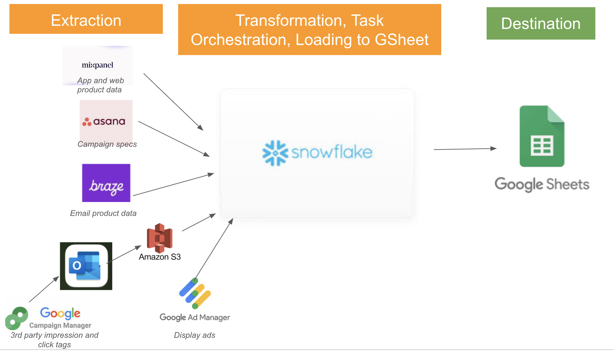

# campaign_monitor

In my experience most consumers of data in companies - product managers, marketers, account managers, execs -  would rather use Excel or Google Sheets than any BI tool. 

Accordingly I led a cross-functional effort involving content, CRM, eng and Biz Dev teams to buld a campaign monitoring tool that surfaces all data and insights directly into a Google sheet
https://docs.google.com/spreadsheets/d/1VQ19XAFTSizaU4lb5eBKTsAt0Isj_io4HxPcOkAdzbg/edit?gid=1875806440#gid=1875806440

The code in this repo is a skeleton for writing data from snowflake directly to a google sheet.

The google sheet itself shows all specs and guarantees for a campaign and how different parts of the campaign are performing. 

A user can click into various filters on the left side of the Campaign Monitor tab and the data will update. Some highlights:
- Users can filter for any IO in the top left
- Filters change the output starting in row 14. The filters control the SELECT and WHERE clauses in a SQL statement to produce the output
- A custom google apps script controls the formatting of dates, numbers-in-thousands and percentages in the output columns.

A user can also one-click to get all the raw data so they can build their own pivot tables.

The ETL process that sources data into the google sheet is in the image below. Some highlights:
- We extract impression and click data from our partners' tag managers by having reports sent to email, moving that data into S3 and then to snowflake
- Tasks are written in snowflake notebooks using SQL and python stored procedures.
- All orchestration takes place in snowflake via their native task orchestration tools.
 

